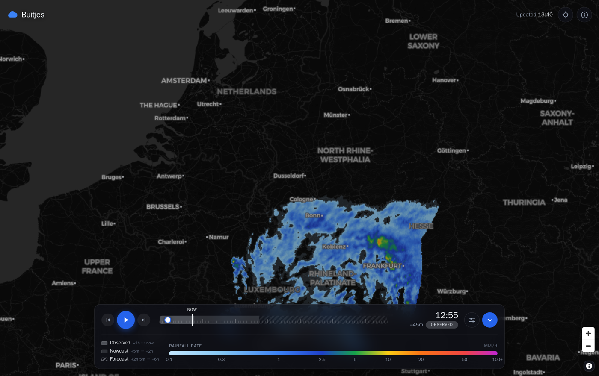
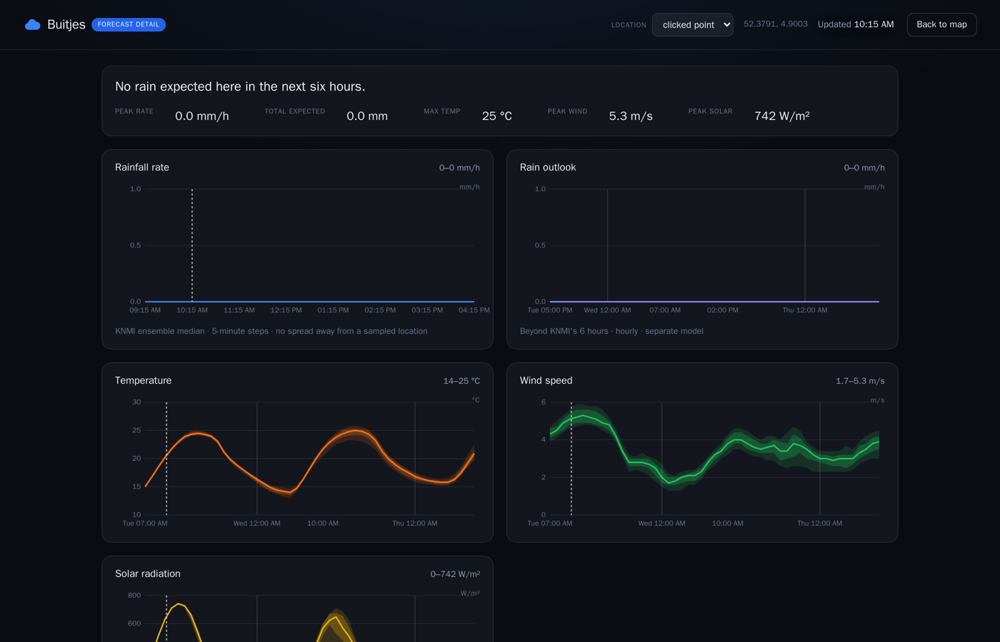

# Buitjes

Self-hosted precipitation radar and short-range nowcast for the Netherlands,
built on KNMI's seamless ensemble. *Buitje* is Dutch for a passing shower.

*Mostly written by an AI coding assistant — see [Built with AI assistance](#built-with-ai-assistance).*



It answers one question well — **is it going to rain on me, and when** — and
answers it with the uncertainty intact, because a single number for something
as twitchy as convective rain is a number that will be wrong.

## What it does

- **A radar map** covering the last hour of observations and the next six hours,
  scrubbable on a timeline that marks which part is measured (`observed`), which
  is extrapolated (`nowcast`), and which is model (`forecast`). The distinction
  matters more than the pixels do. Where no radar can see, the readout says so
  rather than saying "dry".

- **Twenty members shown as one field, without flattening them.** The map draws
  the *probability-matched mean*: the ensemble mean decides where the rain is,
  and the members' own distribution decides how hard it falls. Averaging alone
  smears one shower across twenty guesses at its position; a median erases it
  entirely unless half the members hit the same square kilometre.
- **Hover anywhere** for the rain rate under the cursor; click for a full
  forecast at that exact coordinate rather than snapping to a preset location.
- **A looping radar on the detail page**, centred on the location: the last
  hour measured and the next two extrapolated. The charts say how much and
  when; only a picture says which way it is coming from, and whether a shower
  will hit you or pass five kilometres north.
- **Point forecasts with real ensemble spread** for locations you configure —
  p10/p25/median/p75/p90 and a probability of rain per five-minute step, taken
  by sampling all 20 KNMI members while the timestep is in memory. Probability
  comes in two flavours: on your square kilometre, and within ten of them. The
  second is usually what you meant, because members disagree about where a
  shower will land long before they disagree that one is coming.
- **Alerts.** "Tell me when it is about to rain at home", delivered to any
  webhook — ntfy, Gotify, Home Assistant, a two-line script. Fires on the edge
  and then stays quiet, because an alerting system's real failure mode is
  crying wolf twelve times for one shower. A rule can watch the median, a
  percentile, or the probability itself — the median never crosses for a shower
  only a third of the ensemble puts on your street, so for those it is the
  wrong question rather than a stricter one.
- **A JSON API** shaped for a homepage dashboard widget.
- **Five basemaps**, dark through high-contrast, none needing an API key.



## How it works

```
┌──────────────────────── docker compose ────────────────────────┐
│                                                                │
│  ingestor (Python)                weather-app (Rust / axum)    │
│  ─ subscribes to KNMI's MQTT      ─ serves the frontend        │
│    notification service           ─ /api/config   the manifest │
│  ─ decodes NetCDF4 (h5py)         ─ /api/frames/<file>.webp    │
│  ─ 20 members → one field (pmm)   ─ /api/point/<name>          │
│  ─ resamples rows to Mercator     ─ /api/current/<name>        │
│  ─ encodes 16-bit WebP frames     ─ /healthz  data freshness   │
│                                   ─ /livez    is it serving?   │
│           │                                ▲                   │
│           ▼                                │                   │
│   docker volume "frames": *.webp + manifest.json (ro for the   │
│   server, which never writes)                                  │
└────────────────────────────────────────────────────────────────┘
```

**Why two languages.** The scientific formats have mature Python tooling (h5py,
pyproj) and nothing worth using in Rust. So Python does the science once per
cycle and the Rust server stays a dumb, fast file server of pre-baked frames.
The halves share nothing but a volume, and **the manifest is the contract** —
written last and atomically, so a reader gets either the whole old cycle or the
whole new one, never a mixture.

**The frame format.** Lossless WebP, with rain rate as a 16-bit fraction of
full scale split across R (high byte) and G (low byte), and blue flagging the
pixels no radar measured — about a quarter of an observed frame, which used to
be published as though it were dry. Frames are opaque, and dry is a rate of
zero rather than an alpha of zero: a browser reads a pixel back through a 2D
canvas, which premultiplies, so anything stored under alpha zero comes back as
zeros — which had been quietly swallowing the blue flag ever since it was added.
Opaque frames also came out 5% smaller.
The frontend recombines the bytes in a WebGL shader and applies the colour ramp
on the GPU, so changing the palette costs no refetching. Dry pixels are fully
zeroed rather than merely transparent — the long uniform runs are what keep a
780×780 frame around 30 KB.

**A band for every pixel, not just the configured points.** Alongside each rain
frame is a second one carrying p10, p50 and p90 of the ensemble — three rates,
one byte each. A byte is enough because the scale is logarithmic: over the
ramp's own range a step is 2.8% *of the rate*, finer than KNMI's 0.01 mm/h
quantisation at the bottom and far finer than a colour ramp can show, where the
16-bit linear encoding the rain frames use spends its precision at 90 mm/h
where nobody can read it.

The percentiles are taken after each member's maximum over a small
neighbourhood, and that is the part that matters. Percentiles of one square
kilometre are dominated by the members disagreeing about *where* a shower lands
rather than whether one is coming, so on 60% of the pixels the map paints rain
such a band has its lower edge pinned to zero — it can say "up to" and never "at
least". A radius turns that position disagreement into a spatial tolerance. It
also lifts the whole band, so too wide and it climbs off the field it describes:
at 3 km the drawn value still falls inside the band 91% of the time, at 20 km
only 66%. `SPREAD_RADIUS_KM` documents the trade and blank switches the layer
off; it is a separate file so a reader who never opens it never downloads it.

**The timestep that isn't there.** Roughly once a cycle, somewhere around the
three-hour lead, KNMI's blend publishes a dead step: all twenty members
byte-identical, the field empty but for a stripe of exactly 1.00 mm/h along the
southern edge of the domain. Read literally it is five minutes of nationwide dry
in the middle of a rain band — a hole in the chart, a blank frame in the loop,
and a shower the summary line calls over an hour early. An ensemble whose
members agree to the bit is the one thing a real ensemble cannot be, so the
ingestor catches it on that, stands in for it with the member-wise average of
the steps five minutes either side, and publishes the result marked
`estimated` — a badge on the map, a hairline on the chart. Where there is
nothing either side to stand in for it, the step is dropped instead: a gap in
the timeline is the honest answer, and "we don't know" beats "it's dry"
everywhere else in this app too.

**Why rows get resampled.** MapLibre stretches an image across four corners
linearly *in Web Mercator space*. KNMI's grid is regular in latitude, and
latitude is not linear in Mercator, so handing the grid over unchanged would
misplace rain by kilometres away from the middle of the domain.

## Running it

Needs Docker and a free [KNMI Open Data](https://dataplatform.knmi.nl/) API key.

```bash
git clone https://github.com/MennoJ97/buitjes.git && cd buitjes
cp .env.example .env      # then put your KNMI key in it
docker compose -f docker-compose.yml -f docker-compose.dev.yml up --build
```

Open <http://localhost:3000>. The first cycle takes a minute or two to arrive;
the page says so rather than showing an empty map.

Everything is configured through `.env`, which documents each option and why it
has the default it does — including which locations get point forecasts, the
alert rules, and what CORS, API keys and rate limiting each actually protect
you from.

For a real deployment, put it behind a reverse proxy rather than publishing
port 3000: `docker-compose.yml` carries Traefik labels and a rate limiter, and
`BUITJES_HOST` and `BUITJES_MIDDLEWARES` in `.env` set the hostname and the
middleware chain. Two things worth knowing before you do:

- Put an auth middleware in front and you can leave both `API_KEYS` and
  `CORS_ALLOWED_ORIGINS` empty. The key was only ever an identifier — a string
  shipped inside a web page is readable by anyone who opens devtools — and a
  dashboard widget that renders **server-side** never makes a browser request
  at all, so it consults neither.
- `/healthz` reports on the *data*, not on whether the process can serve: it
  returns 503 once the newest forecast passes `MAX_MANIFEST_AGE_SECONDS`. Don't
  wire it into a load balancer health check, or an upstream outage will take the
  whole site down instead of showing the stale-data banner it was built for.
  `/livez` is the one to probe: it answers 200 whenever the process is serving,
  whatever the data looks like. The container healthcheck uses it, and Traefik
  drops an unhealthy container from its routing table — so that endpoint decides
  whether the site exists.
- Losing the healthcheck as a stall signal is what `STALL_ALERT_SECONDS` covers:
  the ingestor sends one alert when the forecast stops advancing, and one when
  it resumes. It needs only `ALERT_WEBHOOK_URL`, not `ALERT_RULES`.

## Data

| | |
|---|---|
| Forecast | KNMI `seamless_precipitation_ensemble_forecast_members` 1.0 — a pySTEPS/NWP blend, 20 members, 5-minute steps to +6 h, reduced to one field by probability matching (Ebert 2001) |
| Observed | KNMI `nl_rdr_data_rtcor_5m` real-time corrected radar composite |
| Conditions | [Open-Meteo](https://open-meteo.com/) ensemble, for temperature, wind, solar and the beyond-6-hour rain outlook |
| Basemaps | [CARTO](https://carto.com/), [OpenFreeMap](https://openfreemap.org/) and [OpenStreetMap](https://www.openstreetmap.org/) |

KNMI open data is CC BY 4.0. This is a hobby project and not an official KNMI
product — for warnings, go to [KNMI](https://www.knmi.nl/) itself.

Inspired by [Nimbus](https://nimbus.yannick.cloud).

## Built with AI assistance

Most of the code here was written by [Claude Code](https://claude.com/claude-code),
working from my direction and against my review. `git log` is the precise record:
every non-merge commit but the first carries a `Co-Authored-By` trailer naming the
model, and the messages set out the reasoning and the measurements behind each
change.

Saying so because you should know what you are reading, not as an apology for it.
Read it the way you would read any code whose author you have not met.

## License

[MIT](LICENSE). KNMI's data has its own terms — CC BY 4.0 — which this licence
does not cover or override.
